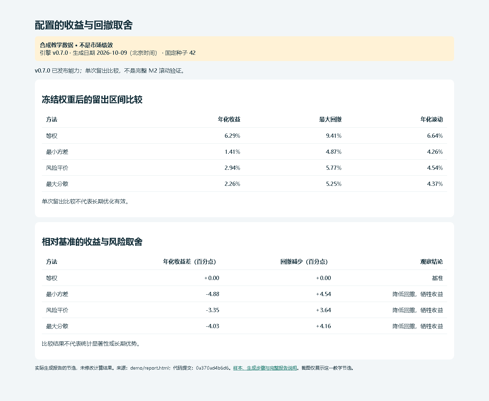

# 组合决策引擎

[](LICENSE)

比较不同配置的收益与回撤，核对资金进出，计算不同条件下的现金缺口。输出可打开的报告、逐日账本和输入记录，方便检查每个结论怎么算出来。

## 安装和首次试用

本轮对应[发布页](https://github.com/KILING-TASI/portfolio-decision-engine/releases/tag/v0.8.2)；下载时以实际上传的完整源码、wheel、sdist 与校验清单为准。源码按下面步骤安装；下载 wheel 后，将安装命令末尾的 `.` 换成该 wheel 文件路径。pip 安装不会自动注册 AI 工具中的 Skill。

本轮源码版本为 `0.8.2`。统一安装入口需要 Python 3.10 或以上。在完整源码目录新建自己的 Python 环境，下面的 Windows 命令不需要激活脚本：

```powershell
python -m venv .venv
.\.venv\Scripts\python.exe -m pip install .
.\.venv\Scripts\portfolio-decision-engine.exe --help
.\.venv\Scripts\portfolio-decision-engine.exe demo --out-dir reports/demo --auto-name
```

工具名与仓库名相同；在已激活的环境中可以直接输入工具名。Linux/macOS 使用 `.venv/bin/python` 和 `.venv/bin/portfolio-decision-engine`。教学结果写入当前工作目录；`--auto-name` 自动另选新名字，旧结果保留。不加该参数时，教学入口拒绝已有目录。`portfolio-decision-engine run --help` 查看原生参数，原来的命令继续兼容。本仓是独立 CLI，不提供可直接发现的 Skill 安装入口。安装可能需要联网获取普通构建依赖；组合计算需要 NumPy、pandas、SciPy、scikit-learn、statsmodels；首次下载耗时取决于网络，已安装的环境无需重复下载。教学离线。下面保留原生入口及此前发行记录，本轮安装和版本以本节为准。

## 先跑一个例子

需要 **Python 3.10 或以上**。下载或克隆本仓库，在仓库目录打开终端。安装时需要联网获取 NumPy、pandas、SciPy、scikit-learn、statsmodels 及其依赖；下面的教学演示离线运行，不获取真实行情。

Windows PowerShell：

```powershell
py -3 -m venv .venv
.\.venv\Scripts\python.exe -m pip install .
.\.venv\Scripts\python.exe -m portfolio_engine demo --fast --out reports/demo-01
```

打开 `reports/demo-01/report.html`。同一目录里还有完整 JSON、账本、模拟交易和输入记录。**再次运行时，把 `demo-01` 换成新名字；已有结果不会覆盖。**

已有 Python 环境时，也可使用：

```sh
python -m pip install .
python -m portfolio_engine demo --fast --out reports/demo-02
```

`--fast` 是快速教学模式。自己的数据格式、错误处理和完整命令见[使用说明](docs/usage.md)。

## 实际结果示例

**回撤变小，也可能以更低收益为代价。**下面这份固定种子的历史教学报告中，等权组合年化收益为 6.29%、最大回撤为 9.41%；最小方差组合分别为 1.41% 和 4.87%。它展示配置取舍，不证明某个方案长期更好。

[](docs/report-previews.md)

截图来自 2026-10-09 实际生成并检查的合成数据报告。[预览与复现记录](docs/report-previews.md)保留了当时的代码版本、输入和限制；这不是市场绩效，也不是对新版本的视觉验收。

想看入金、解冻、延迟到账和预算无解时会怎样，在装好本仓之后运行：

```powershell
.\.venv\Scripts\python.exe examples/run_scenarios.py --out reports/scenarios-01
```

打开 `reports/scenarios-01/scenario-index.html`，可分别查看预期、实际和报告。[七组场景索引](examples/scenario-index.json)说明复用了哪些手算和反例。例如，入金 1000 后资产从 1000 变为 2000，投资收益仍为零；缺少费用或到账依据时，完整现金余额保留为未知。脚本和样例由源码及源包提供，运行模块由本仓安装包提供。

## 能做什么，暂时不能做什么

| 你要检查的问题 | 当前源码能做的事 | 需要保留的限制 |
|---|---|---|
| 配置是否值得调整 | 比较等权、最小方差、风险平价等方案的收益、回撤和费用 | 不保证更优，也不生成实际交易指令 |
| 回撤预算能否满足 | 模拟路径、筛选候选；滚动重新估计并在下一段数据检验 | 无解就报告无解，参考组合不冒充预算解；模拟误差不是投资有效认证 |
| 入金后是不是赚了更多 | 分开核对投入、损益、累计 TWR 和年化 XIRR | 观察估值与收益路径模拟的时点、求根方法不同，不能只看名称替换 |
| 钱什么时候够用 | 分开记录可用现金、冻结资金和条件变现款，计算首次缺口和最大缺口 | 不确认实际成交、到账、借款或未来收入，不给缺口概率 |
| 基金是否持有同一批资产 | 汇总披露支持的底层资产、发行人和未知部分 | 披露并非实时完整持仓，也不是基金综合评价 |
| 数据能不能直接用于收益分析 | 核对净值、分红拆分声明、币种、日期和缺失情况 | 原始价格、累计净值及不完整事件不能直接当复利总回报 |

真实成交、整数份额、最低佣金、基金确认、盘中 QDII 估值、税率日历和通胀／信用联合情景尚未完整适配。详细方法和支持范围见[设计与实现说明](docs/design-v0.4.md)、[现金需求说明](docs/cash-demand.md)和[数据接入指南](docs/data-bridge.md)。设计目标不等于全部已实现。

## 独立使用与其他仓库的关系

这是一个**独立 Python 计算引擎和 CLI**，命令入口为 `python -m portfolio_engine`，安装后也提供 `portfolio-engine`。本仓库没有 `SKILL.md`，不把它称为可直接安装发现的 Skill。

生成主报告不需要安装 research-workbench 或其他自家专业仓库；普通科学计算依赖按本仓声明安装。开发用的 `pytest`、`build` 属于 `dev` 可选依赖。这里没有 PDF 解析 extra：原页字段解析由对应专业工具负责，本引擎消费明确提供的 JSON／CSV 和披露记录。

research-workbench 可以调用本引擎，并继续负责资料组织、公司经营与估值判断、基金综合评价、解释和报告接续；能被工作台调用不等于本引擎依赖工作台运行。[两仓分工及旧调用兼容范围](docs/workbench-cashflow-integration.md)说明了已经搬迁和暂未搬迁的计算。当前定投与行业退出的后续迁移仍在契约盘点阶段，不能称已经完成。

需要联网取数时，必须明确使用 `collect --online`；演示和已有输入分析不会自动打开采集。取得响应不代表事件齐全、原文核验或历史可得时间已经确认。

## 当前源码与旧发布包

| 你使用的内容 | 实际状态 |
|---|---|
| 当前 `main` 源码 | 已集成原 PR #1–#11：披露转换、完整 M2 滚动检验、统计反例、账户敞口、现金需求、观察收益迁移、数据目录、独立安装验收及七组实例 |
| [旧 Release v0.7.0](https://github.com/KILING-TASI/portfolio-decision-engine/releases/tag/v0.7.0) | 保持原资产；不包含后续新增的全部模块和资源，不能按当前首页推断旧包支持范围 |
| [Release v0.8.0](https://github.com/KILING-TASI/portfolio-decision-engine/releases/tag/v0.8.0) | 已发布，来源提交 `84afe336ac521bf35d39d91428783d7a64f87418`；安装包与源码下载见下方 |

此前发行包版本为 `0.8.0`，旧 `v0.7.0` 安装包仍保留。核对实际模块、接口／方法版本及输入记录；旧报告、截图和发行资产保持原样。历史验收文档中的“待审”是当时记录，当前源码状态以上表为准。

## 验证、许可与来源

- 现有 206 项回归测试，以及单仓隔离安装、CLI 报告和七组教学场景已经验证。CI 检查可在 [Actions](https://github.com/KILING-TASI/portfolio-decision-engine/actions) 查看；首页文案改动的最新检查以对应 PR 为准。
- [独立安装与验证范围](docs/usage.md)、[场景输入与资源](examples/README.md)、[统计方法与反例](docs/statistical-validation-methods.md)分别记录通过范围。CLI 成功不代表真实资料、投资效果、自然语言发现或视觉验收通过。
- 有限真实响应只核对了两只基金各 42 条净值档案的字节记录；完整事件、历史可得和真实 M2 正向验证仍有缺口，详见[数据目录与来源差异](docs/data-bridge.md)。真实账户和原始材料不在公共包中。
- 原创代码及有权授权的原创说明采用 [MIT](LICENSE)。第三方代码、公告、研报、行情和字体继续适用各自权利；见[许可范围](docs/license-scope.md)、[第三方说明](THIRD_PARTY_NOTICES.md)和[使用边界](DISCLAIMER.md)。

开发者测试与构建：

```sh
python -m pip install ".[dev]"
python -m pytest -q
python -m build
```

## v0.8.0 下载与安装

v0.8.0 已于 2026-10-10 发布。安装依赖需要联网，教学演示离线运行；下载后可先用校验文件核对 SHA256。

- [wheel 安装包](https://github.com/KILING-TASI/portfolio-decision-engine/releases/download/v0.8.0/portfolio_decision_engine-0.8.0-py3-none-any.whl)、[干净源码 ZIP](https://github.com/KILING-TASI/portfolio-decision-engine/releases/download/v0.8.0/portfolio-decision-engine-0.8.0-source.zip)、[源码分发包](https://github.com/KILING-TASI/portfolio-decision-engine/releases/download/v0.8.0/portfolio_decision_engine-0.8.0.tar.gz)与 [SHA256 校验文件](https://github.com/KILING-TASI/portfolio-decision-engine/releases/download/v0.8.0/SHA256SUMS.txt)均已提供。完整资产列表见 [v0.8.0 发布页](https://github.com/KILING-TASI/portfolio-decision-engine/releases/tag/v0.8.0)。
- wheel 安装：`python -m pip install portfolio_decision_engine-0.8.0-py3-none-any.whl`，然后运行 `python -m portfolio_engine demo --fast --out reports/demo-03`。安装需要联网获取上述普通依赖；教学运行离线。
- 源码 ZIP：解压后进入包含 `pyproject.toml` 的目录，执行首页的源码安装命令；七组场景脚本在 `examples` 中。
- [中文发布说明](docs/release-v0.8.0.md)列出新增能力、保留限制与安装方式。

## 输出目录参数

原生子命令统一支持 `--out-dir`，旧 `--out` 保留为兼容别名，两者只能指定一个。参数接受新目录，不是文件名；例如 `portfolio-decision-engine run convert-lookthrough --input holdings.json --out-dir reports/lookthrough-first`。结果JSON和来源底稿保存在该目录中；重复运行换新目录，或在仓库名入口加 `--auto-name`。
